# Crawlers Of The Skeleton Forest
It is a **2d dungeon crawler single player game** consisting of 4 stages. The player must defeat all of the enemy in the stage before advancing to another. After clearing each stage, a chest will generate which may drop one or two potion, the potion may be a healing potion/strength potion/poison potion, where player may interact with these and gain +1 or +2 hearts, or gain +1 damage for the player. The game is composed of Finite State Machine (FSM) and Markov Model.

## Characters
| Image | Character | Health | Damage |
| ----------- | ----------- | ----------- | ----------- |
|  | Player | 13 | 1 |
|  | Slime | 2 | 1 |
| 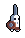 | Swordsman | 6 | 3 |
| 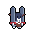 | Kram | 6 | 3 |
| 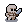 | Skeleton | 3 | 2 |
| 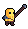 | Lancer | 7 | 3 |
| 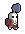 | Berserker | 9 | 2 |

## Potion
| Image | Type | Description |
| ----------- | ----------- | ----------- |
|  | Health Potion | May heal the player +1 or +2 heart/s or may damage the player -1 heart |
| 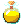 | Strength Potion | May boost player damage by +1 or +2 |

# Here are figures which describes the behavior of the NPC.

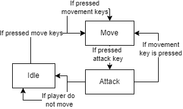

> *Finite State Machine of Player*

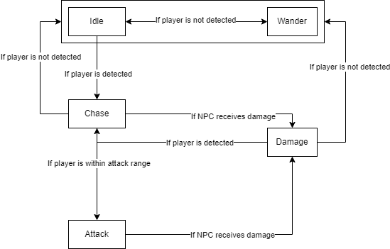

> *Finite State Machine of NPC*

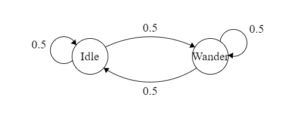

> *Markov Model for Enemy Decision*

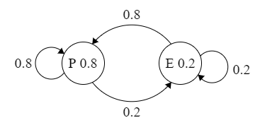

> *Markov Model for Potion Generation*

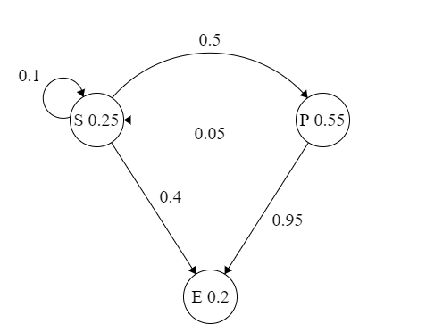

> *Markov Model for Type of Potion*

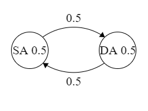

> *Markov Model for Potion Effectivnes*

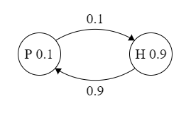

> *Markov Model for Poison or Heal of Potion*
